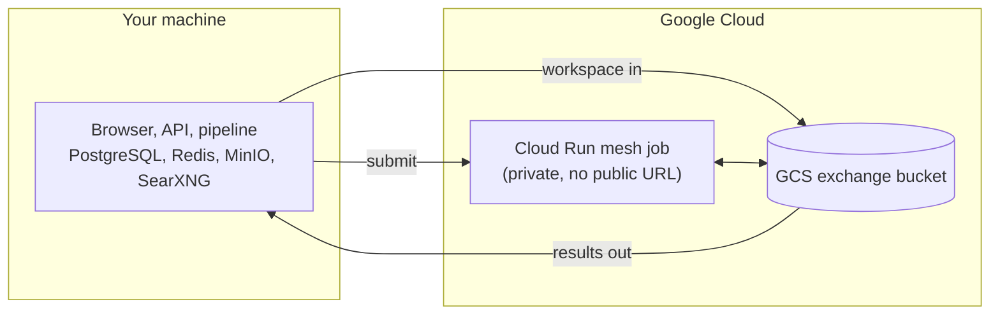

# Deploying the mesh executor

Hexera runs on your machine. The API, the pipeline, PostgreSQL, Redis, MinIO and SearXNG are all
local. **One** component is remote: the Cloud Run job that performs the meshing, and the GCS bucket
it exchanges workspaces through.



Nothing else is deployed. There is no hosted API, no hosted pipeline, no application database in
the cloud and no public URL.

## What this tooling owns

| Resource | Purpose |
|---|---|
| Artifact Registry repository | holds the mesh image |
| mesh image | the meshing toolchains, promoted by digest from a validated release |
| Cloud Run mesh job | runs one mesh per execution |
| mesh runtime service account | the job's identity: compute-only |
| GCS exchange bucket | the workspace the local pipeline and the job trade through |
| exchange lifecycle policy | expires transient workspace objects |

Each resource is created when absent and validated when already present. There is no mode to
choose: a project that already owns a mesh job can still have its exchange bucket created here.

## Commands

```bash
make mesh-doctor    # read-only diagnosis: config, auth, resources. Mutates nothing.
make mesh-deploy    # provision or update everything above. Idempotent.
```

Inside `deploy/gcp/` the individual stages are available for re-running one step while debugging:
`bootstrap`, `validate`, `preflight`, `enable-apis`, `artifact-registry`, `service-account`,
`mesh-tier`, `iam`, `state`, and `provision` for all of them.

`make smoke JOB_ID=<uuid>` submits a real job to the deployed mesh job. It refuses to run unless
`MESH_SMOKE_AUTHORIZED=yes`, because it spends money and mutates a live resource.

## IAM

Two principals, three operations. Every binding is scoped to a named job or bucket; nothing is
granted project-wide.

| Principal | Role | Why |
|---|---|---|
| your local caller (`MESH_INVOKER`) | `run.jobsExecutorWithOverrides` on the mesh job | submit an execution with the job id |
| your local caller | `storage.objectUser` on the exchange bucket | write the input workspace, read results |
| mesh runtime account | `storage.objectUser` on the exchange bucket | read its input, write its output |

`objectUser` rather than `objectAdmin`: the adapters create, read, list and delete objects and never
manage object ACLs or per-object IAM. The mesh identity is granted no secret, no Cloud Run
administration and no project-level role.

The deployer running `make mesh-deploy` needs `run.admin`, `artifactregistry.admin`,
`storage.admin` and `iam.serviceAccounts.create` in the project. This tooling does not grant those
to itself.

## Connecting the application

`.env` is read **before** provisioning, not written after it. These four values declare what to
create, and provisioning uses them verbatim; if the resources already exist, they name those:

```bash
GCP_PROJECT_ID=<your project>
GCP_REGION=<region>
CLOUDRUN_JOB=<mesh job name>
GCP_MESH_BUCKET=<exchange bucket>
```

Authenticate with `gcloud auth application-default login`, ticking every checkbox on the consent
page, then **copy** the file it names, never move it: every other gcloud tool on the machine reads
it where it is.

```bash
install -D -m 600 \
  "$HOME/.config/gcloud/application_default_credentials.json" \
  secrets/gcp/application_default_credentials.json
```

`make dev-doctor` verifies the configuration, and `make dev-up` refuses to start until it is
complete.

## Deployment state

The `state` stage (`cd deploy/gcp && make state`) writes `deploy/output/deployment.json`: the mesh resources, whether each was created
here or supplied, and the image digest. It contains no credentials. The file is gitignored.

## Submission semantics

A mesh is expensive, so submission is **at most once per operation identity**, not exactly once,
which is not achievable across a network boundary.

Before Cloud Run is contacted, the worker claims an identity derived from the job id and the run's
execution generation. Only the worker that wins that claim uploads the input and triggers the job.

- The trigger returns a long-running **Operation**; its name is stored as the claim's evidence and
  the claim becomes `accepted`.
- The exchange objects are `gs://$GCP_MESH_BUCKET/jobs/<64-hex operation key>/{input.tar.gz,
  output.tar.gz,result.json}`. The keys are derived from the identity, so a replacement worker
  resolves the same namespace.
- The digest stored with the claim is the digest of the bundle actually uploaded, so a replay
  carrying different workspace content is refused rather than overwriting the accepted input.
- **Same-generation replay**: a worker died, a task was redelivered, finds the accepted claim and
  reads the result from those same objects. It does not trigger Cloud Run again.
- **`indeterminate`**: the request may have reached Cloud Run and the acknowledgement did not come
  back. The run fails safely and is **never retried automatically**, because guessing that nothing
  was submitted is how you pay for the same mesh twice. Diagnose it by looking at the job's
  executions in the Cloud Console.
- **A new execution generation** is a new identity and may submit once of its own. Starting a new
  run is how you retry deliberately.
